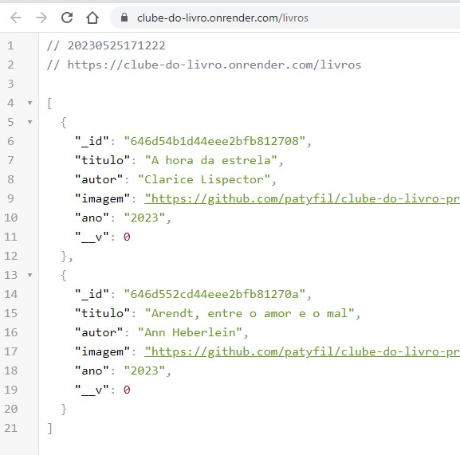
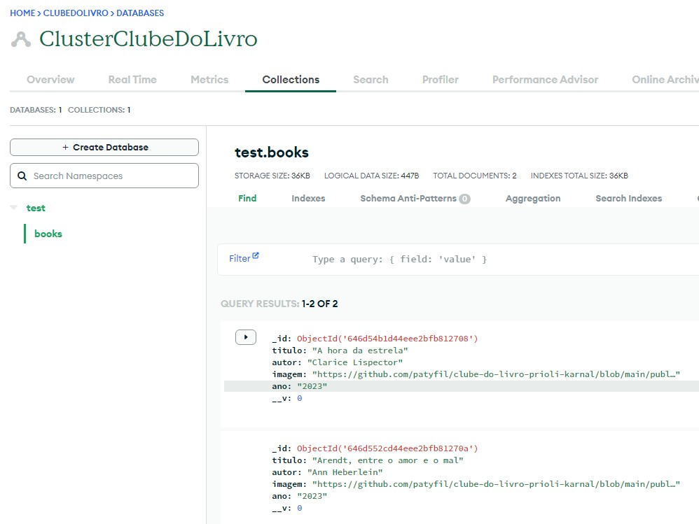

# [Desafio do curso Online Eu ProgrAmo | BE1 | Turma 01](https://euprogramo.thinkific.com/courses/curso-online-eu-programo-be1-turma-01?utm_source=LinkedIn&utm_medium=social&utm_campaign=student-social-share)
## Professora: [Simara Conceição](https://www.linkedin.com/in/simaraconceicao/)  


Servidor feito com node.js.

## O desafio foi:
```

Um sistema para gerenciar os livros que temos em casa, onde a pessoa poderá cadastrar os livros, editar os livros, excluir os livros e listar todos os livros cadastrados.  
Mas também qualquer outra ideia que achar mais legal e viável para você adicionar ao seu portfólio.  

📌O model de um livro pode ser:  
id: gerado automático pelo mongo
nome: string
autora: string
categoria: string  

O principal é que esse projeto precisa estar integrado com o MongoDB,  
ter a versão no Github e estar deployado no Render.  

Ou seja, dentro do MongoDb, dentro da organização,  
crie uma nova database e siga o tutorial da aula de integração com o MongoDB usando o mongoose.  

Quando você finalizar o projeto e tiver a URL de produção,  
os testes do CRUD pelo insomnia devem estar funcionando corretamente.  

```

Tudo isso usando a linguagem JavaScript, junto de ferramentas como VS Code, Node.JS, Insomnia, Render, MongoDB, Mongoose e o Git.  

## Segue o desafio realizado com extras:  

[Link de Produção do Back no Render](https://clube-do-livro.onrender.com/livros)  

[Repositório do Back no GitHub](https://github.com/patyfil/clube-do-livro-back-end)


## Imagens do Projeto Back:  
### Render:  
  
### MongoDB:  
  

Quis ir além e fazer o front em React, para conectar o BackEnd, então resolvi fazer um curso na Alura, [Curso de React: desenvolvendo com JavaScript](https://cursos.alura.com.br/course/react-desenvolvendo-javascript), com **Paulo Silveira** e o instrutor **Vinicios Neves**, o projeto da Alura se tratava de um site chamado 'Organo' que listava os colaboradores da organização, então alterei o projeto para listar os livros do Clube do livro da **Gabriela Prioli** e **Leandro Karnal**, na qual já tem 4 edições até esse ano (2023).

Ao terminar o curso fiquei frustrada por não conseguir integrar meu BackEnd com o Front construido no curso da Alura, porque os sites tem estruturas totalmente diferentes entre si e como não entendo muito de React, resolvi cadastrar os livros no próprio código e fazer outras melhorias.  

* Para ver o deploy do clube do livro, acesse esse [link](https://clube-do-livro-prioli-karnal.vercel.app/).  

No site coloquei alguns efeitos no CSS para os livros, fiz o site responsivo para mobile, alterei o cabeçalho e rodapé e outros detalhes, particularmente gostei bastante do resultado, mas não contente rs... percebi que o site ficou um pouco pesado (13,5 MB e leva 2,8 segundos para carregar, no site do vercel), pois contém muitas imagens (dos livros), então fiz outro curso da Alura:  

[Curso de Performance Web I: otimizando o front-end](https://cursos.alura.com.br/course/otimizacao-performance-web), com **Sérgio Lopes**.

Fiz o curso rapidamente (porque estou fazendo outros cursos em paralelo) e achei o curso maravilhoso, tem umas dicas muito boas e pretendo futuramente refazer para praticar melhor, mas para o momento usei algumas dicas do curso para melhoria do meu site, como: diminuir as imagens sem perda de qualidade, tirando metadados das imagens, tem várias outras dicas como tirar comentários e linhas desnecessárias no código e outras que será difícil explicar aqui sem deixar o texto muito longo, o curso vale a pena e recomendo.  

Agora com poucas melhorias que fiz, o site ficou com [ MB ] e leva [ ] segundos para carregar.  

Para quem quiser ver o código do site do clube do livro:  
[Clube do Livro com Gabriela Prioli e Leandro Karnal](https://github.com/patyfil/clube-do-livro-prioli-karnal)  

## Imagem do Projeto no Front:  
